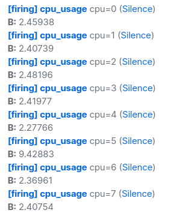
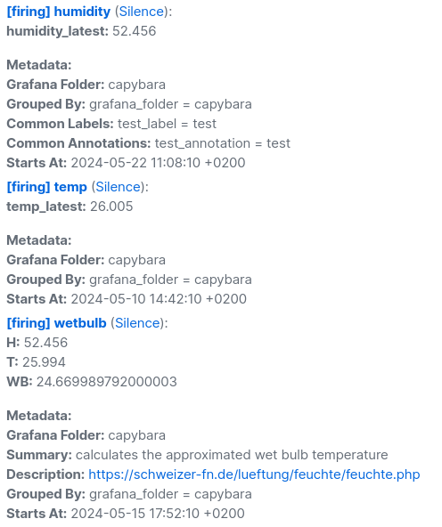
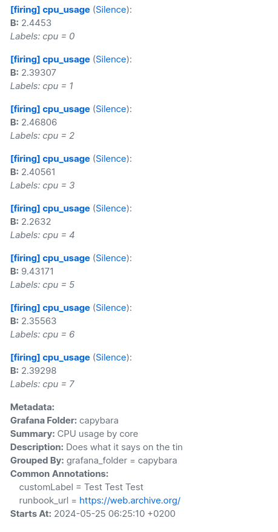
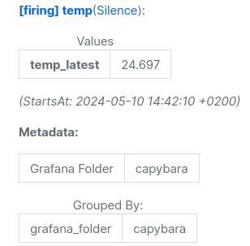
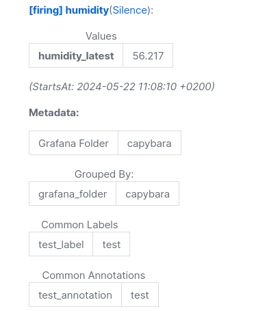
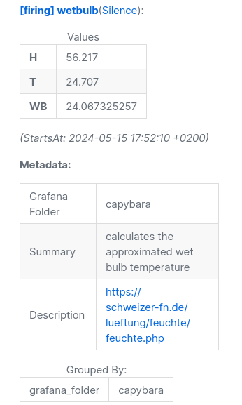
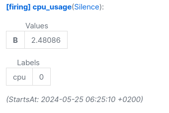
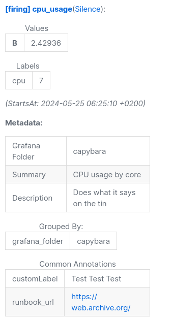

# Templates

## `default`


```txt
[firing] humidity:
humidity_latest = 51.479
```

```txt
[firing] temp:
temp_latest = 26.262
```

```txt
[firing] wetbulb:
H = 52.158
T = 26.456
WB = 25.023772144
```

<details><summary>cpu_usage</summary>



```txt
[firing] cpu_usage cpu=0:
B = 2.4578
[firing] cpu_usage cpu=1:
B = 2.4058
[firing] cpu_usage cpu=2:
B = 2.48043
[firing] cpu_usage cpu=3:
B = 2.41827
[firing] cpu_usage cpu=4:
B = 2.2762
[firing] cpu_usage cpu=5:
B = 9.42877
[firing] cpu_usage cpu=6:
B = 2.36813
[firing] cpu_usage cpu=7:
B = 2.40608
```

</details>

## `oneliner`


```txt
[firing] humidity: humidity_latest = 50.015
```

```txt
[firing] temp: temp_latest = 26.198
```

```txt
[firing] wetbulb: H = 50.045, T = 26.155, WB = 24.478525925
```

<details><summary>cpu_usage</summary>


```txt
[firing] cpu_usage cpu=0: B = 2.46086
[firing] cpu_usage cpu=1: B = 2.40885
[firing] cpu_usage cpu=2: B = 2.48347
[firing] cpu_usage cpu=3: B = 2.4212
[firing] cpu_usage cpu=4: B = 2.27917
[firing] cpu_usage cpu=5: B = 9.42941
[firing] cpu_usage cpu=6: B = 2.37108
[firing] cpu_usage cpu=7: B = 2.40908
```

</details>

## `detailed`



```txt
[firing] humidity
humidity_latest: 52.097

Metadata:
Grafana Folder: capybara
Grouped By: grafana_folder = capybara
Common Labels: test_label = testCommon Annotations:
test_annotation = test
Starts At: 2024-05-22 11:08:10 +0200
```

```txt
[firing] temp
temp_latest: 26.155

Metadata:
Grafana Folder: capybara
Grouped By: grafana_folder = capybara
Starts At: 2024-05-10 14:42:10 +0200
```

```txt
[firing] wetbulb
H: 52.097
T: 26.155
WB: 24.758552105000003

Metadata:
Grafana Folder: capybara
Summary: calculates the approximated wet bulb temperature
Description: https://schweizer-fn.de/lueftung/feuchte/feuchte.php
Grouped By: grafana_folder = capybara
Starts At: 2024-05-15 17:52:10 +0200
```

<details><summary>cpu_usage</summary>



```txt
[firing] cpu_usage
B: 2.46297
Labels: cpu = 0

[firing] cpu_usage
B: 2.41088
Labels: cpu = 1

[firing] cpu_usage
B: 2.48554
Labels: cpu = 2

[firing] cpu_usage
B: 2.42328
Labels: cpu = 3

[firing] cpu_usage
B: 2.28143
Labels: cpu = 4

[firing] cpu_usage
B: 9.42974
Labels: cpu = 5

[firing] cpu_usage
B: 2.37328
Labels: cpu = 6

[firing] cpu_usage
B: 2.41123
Labels: cpu = 7

Metadata:
Grafana Folder: capybara
Summary: CPU usage by core
Description: Does what it says on the tin
Grouped By: grafana_folder = capybara
Common Annotations:
customLabel = Test Test Test
runbook_url = https://web.archive.org/
Starts At: 2024-05-25 06:25:10 +0200
```

</details>

## `detailed_table`

Plaintext version is the same as `detailed`.

  
  


<details><summary>cpu_usage</summary>

  
(...)  


</details>
